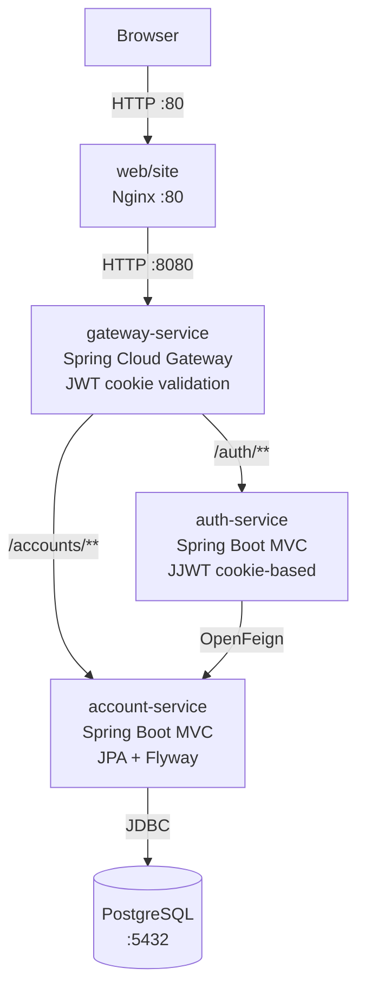
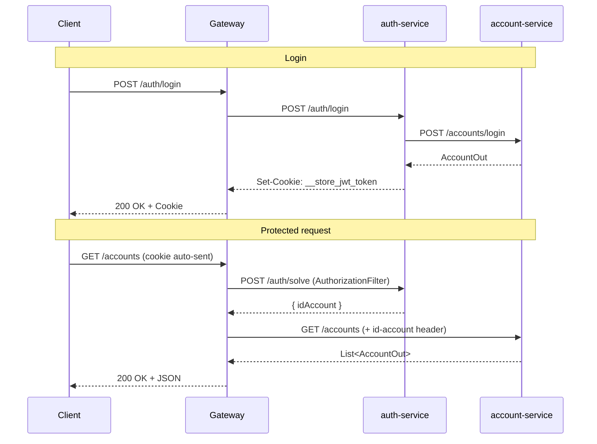

# Store — Microservices Platform

A full-stack, containerized application built with a microservices architecture. The backend is composed of independent Spring Boot services coordinated by an API Gateway, a static frontend served by Nginx, and a Jenkins-based CI/CD pipeline.

---

## Architecture Overview



All backend services run in the same Docker Compose network (`store`) and communicate using internal hostnames. The gateway is the **only publicly exposed backend port** (`:8080`).

---

## Repository Structure

```
pma.261/
├── api/                     # All backend services and shared libraries
│   ├── account/             # Shared library: Feign client + DTOs for account-service
│   ├── account-service/     # Microservice: account management + PostgreSQL
│   ├── auth/                # Shared library: Feign client + DTOs for auth-service
│   ├── auth-service/        # Microservice: authentication + JWT issuance
│   ├── gateway-service/     # API Gateway: routing + JWT authorization filter
│   └── compose.yaml         # Docker Compose for all backend services + DB
├── web/
│   ├── site/                # Static frontend (HTML + vanilla JS) served by Nginx
│   └── compose.yaml         # Docker Compose for Nginx
└── jenkins/
    ├── compose.yaml          # Docker Compose for Jenkins
    └── config/              # Persistent Jenkins home volume
```

---

## Modules

| Module | Type | Description | Docs |
|---|---|---|---|
| `account` | Library | OpenFeign client + DTOs for `account-service` | [README](api/account/README.md) |
| `account-service` | Service | Account CRUD backed by PostgreSQL + Flyway | [README](api/account-service/README.md) |
| `auth` | Library | OpenFeign client + DTOs for `auth-service` | [README](api/auth/README.md) |
| `auth-service` | Service | Authentication, JWT issuance and validation | [README](api/auth-service/README.md) |
| `gateway-service` | Service | API Gateway — routing, CORS, JWT filter | [README](api/gateway-service/README.md) |

---

## Tech Stack

| Layer | Technology |
|---|---|
| Language | Java 25 |
| Framework | Spring Boot 4.0.3 / Spring Cloud 2025.1.0 |
| Gateway | Spring Cloud Gateway (WebFlux) |
| Auth tokens | JJWT 0.13+ |
| Database | PostgreSQL 17 + Flyway |
| Frontend | HTML + Vanilla JS served by Nginx |
| Build | Maven |
| CI/CD | Jenkins (Docker + kubectl + AWS CLI) |

---

## Authentication Flow



---

## Running Locally

**Backend:**
```bash
cd api/
docker compose up -d --build
```

**Frontend:**
```bash
cd web/
docker compose up -d
```

**Jenkins:**
```bash
cd jenkins/
docker compose up -d --build --force-recreate
# available at http://localhost:9080
```

---

## License

See [LICENSE](LICENSE).
