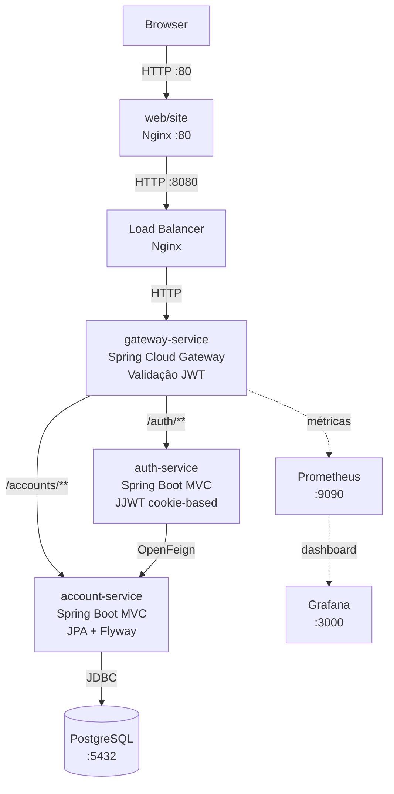

# Store — Plataforma de Microsserviços

Aplicação full-stack containerizada construída com arquitetura de microsserviços. O backend é composto por serviços Spring Boot independentes coordenados por um API Gateway, um frontend estático servido por Nginx e um pipeline de CI/CD baseado em Jenkins.

---

## Visão Geral da Arquitetura



Todos os serviços backend rodam na mesma rede Docker Compose (`store`) e se comunicam via hostnames internos. O **gateway é a única porta backend exposta publicamente** (`:8080` — ou `:80` via load balancer).

---

## Estrutura do Repositório

```
pma.261/
├── api/                          # Todos os serviços backend e bibliotecas compartilhadas
│   ├── account/                  # Biblioteca: Feign client + DTOs para account-service
│   ├── account-service/          # Microsserviço: gerenciamento de contas + PostgreSQL
│   ├── auth/                     # Biblioteca: Feign client + DTOs para auth-service
│   ├── auth-service/             # Microsserviço: autenticação + emissão de JWT
│   ├── gateway-service/          # API Gateway: roteamento + filtro de autorização JWT
│   ├── compose.yaml              # Docker Compose (dev) — todos os serviços + DB
│   └── compose.prod.yaml         # Docker Compose (prod) — imagens do registry
├── web/
│   ├── site/                     # Frontend estático (HTML + vanilla JS) via Nginx
│   └── compose.yaml              # Docker Compose para o Nginx frontend
└── jenkins/
    └── compose.yaml              # Docker Compose para Jenkins (CI/CD)
```

---

## Módulos

| Módulo | Tipo | Descrição |
|---|---|---|
| [`account`](modulos/account.md) | Biblioteca | OpenFeign client + DTOs para `account-service` |
| [`account-service`](modulos/account-service.md) | Serviço | CRUD de contas com PostgreSQL + Flyway |
| [`auth`](modulos/auth.md) | Biblioteca | OpenFeign client + DTOs para `auth-service` |
| [`auth-service`](modulos/auth-service.md) | Serviço | Autenticação, emissão e validação de JWT |
| [`gateway-service`](modulos/gateway-service.md) | API Gateway | Roteamento, CORS e filtro JWT |
| [`web/site`](modulos/frontend.md) | Frontend | Interface estática HTML/JS via Nginx |
| [Jenkins](infra/jenkins.md) | CI/CD | Pipeline de build, push e deploy |

---

## Stack de Tecnologias

| Camada | Tecnologia |
|---|---|
| Linguagem | Java 25 |
| Framework | Spring Boot 4.0.3 / Spring Cloud 2025.1.0 |
| Gateway | Spring Cloud Gateway (WebFlux) |
| Tokens de auth | JJWT 0.13+ |
| Banco de dados | PostgreSQL 17 + Flyway |
| Frontend | HTML + Vanilla JS via Nginx |
| Build | Maven |
| Observabilidade | Prometheus + Grafana |
| CI/CD | Jenkins (Docker + kubectl + AWS CLI) |

---

## Executando Localmente

=== "Backend"
    ```bash
    cd api/
    docker compose up -d --build
    ```
    Serviços disponíveis:
    
    - **Gateway**: `http://localhost:8080`
    - **Prometheus**: `http://localhost:9090`
    - **Grafana**: `http://localhost:3000`

=== "Frontend"
    ```bash
    cd web/
    docker compose up -d
    ```
    Site disponível em `http://localhost:80`

=== "Jenkins"
    ```bash
    cd jenkins/
    docker compose up -d --build --force-recreate
    ```
    Jenkins disponível em `http://localhost:9080`
