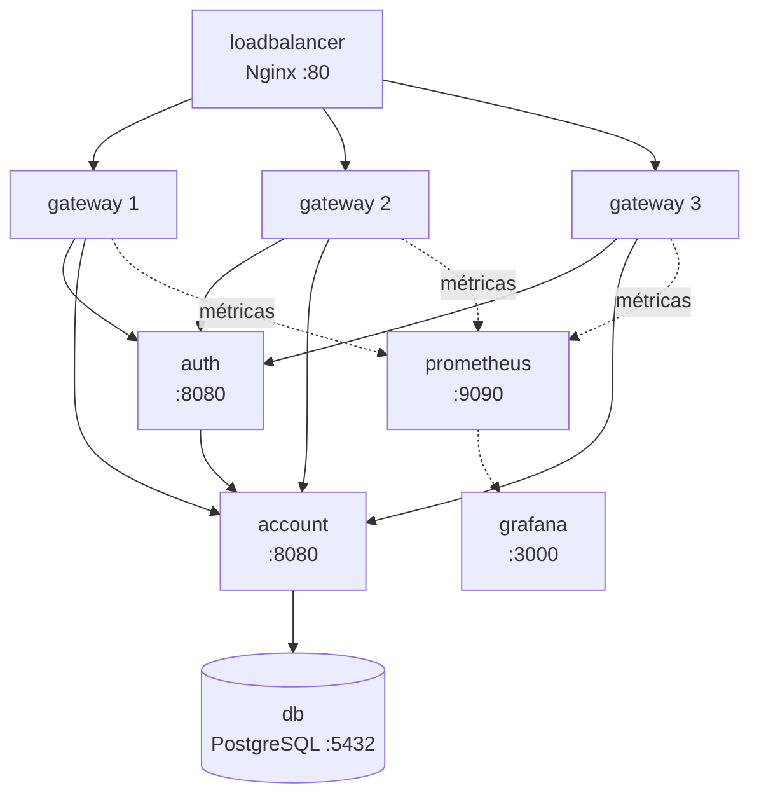

# Docker Compose

A plataforma Store é dividida em três stacks Docker Compose independentes, cada uma com responsabilidade bem definida.

---

## Stack de Backend — `api/`

Arquivo: `api/compose.yaml` | Nome: `store-api`

Sobe todos os serviços backend, banco de dados e infraestrutura de observabilidade.



### Serviços

| Serviço | Imagem / Build | Porta exposta | Réplicas |
|---|---|---|---|
| `db` | `postgres:17` | — (interna) | 1 |
| `account` | build local | — (interna) | 1 |
| `auth` | build local | — (interna) | 1 |
| `gateway` | build local | — (interna) | 3 |
| `loadbalancer` | `nginx:latest` | `80:80` | 1 |
| `prometheus` | `prom/prometheus:latest` | `9090:9090` | 1 |
| `grafana` | `grafana/grafana:latest` | `3000:3000` | 1 |

### Variáveis de Ambiente Necessárias

Crie um arquivo `.env` em `api/`:

```env
VOLUME_DB=/caminho/para/dados/postgres
DB_USER=store
DB_PASSWORD=devpass
DB_NAME=store
JWT_SECRET_KEY=<base64-encoded-secret>
JWT_HTTP_ONLY=true
CORS_ALLOWED_ORIGINS=http://localhost
CORS_ALLOWED_CREDENTIALS=true
SETUP=/caminho/para/configuracoes/prometheus-grafana-nginx
```

### Executando

```bash
cd api/
docker compose up -d --build
```

---

## Stack de Frontend — `web/`

Arquivo: `web/compose.yaml` | Nome: `store-site`

| Serviço | Imagem | Porta exposta |
|---|---|---|
| `site` | `nginx:alpine` | `80:80` |

```bash
cd web/
docker compose up -d
```

---

## Stack de CI/CD — `jenkins/`

Arquivo: `jenkins/compose.yaml` | Nome: `store-ops`

| Serviço | Imagem | Porta exposta |
|---|---|---|
| `jenkins` | build customizado | `9080:8080` |

```bash
cd jenkins/
docker compose up -d --build --force-recreate
```

---

## Stack de Produção — `api/compose.prod.yaml`

Arquivo para ambiente de produção — usa imagens publicadas no Docker Hub em vez de builds locais.

```bash
cd api/
docker compose -f compose.prod.yaml up -d
```

!!! warning "Produção"
    O arquivo `compose.prod.yaml` usa imagens pré-publicadas (`humbertosandmann/account:latest`, etc.). Certifique-se de que as imagens foram publicadas via pipeline Jenkins antes de executar.
