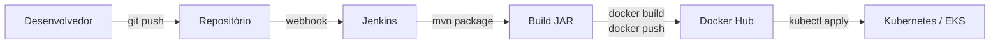

# Jenkins — CI/CD

Pipeline de integração e entrega contínua baseado em Jenkins. Cada microsserviço tem seu próprio `Jenkinsfile` com as etapas de build, publicação da imagem Docker e deploy.

---

## Visão Geral

O Jenkins é executado em um container Docker customizado que inclui as ferramentas necessárias para o pipeline completo:



---

## Ferramentas Incluídas na Imagem

A imagem Jenkins é construída a partir de `jenkins/jenkins:jdk25` com as seguintes adições:

| Ferramenta | Uso |
|---|---|
| Maven | Build dos projetos Java |
| Docker CE | Build e push de imagens |
| kubectl | Deploy no Kubernetes |
| AWS CLI | Autenticação no Amazon ECR / EKS |
| curl, net-tools | Utilitários de diagnóstico |

---

## Docker Compose

```yaml
name: store-ops

services:
  jenkins:
    build:
      dockerfile_inline: |
        FROM jenkins/jenkins:jdk25
        USER root
        # ... instala Maven, Docker, kubectl, AWS CLI
    ports:
      - 9080:8080
    volumes:
      - ${CONFIG:-./config}/jenkins:/var/jenkins_home
      - /var/run/docker.sock:/var/run/docker.sock
    restart: always
```

!!! note "Docker socket"
    O socket `/var/run/docker.sock` é montado para permitir que o Jenkins execute comandos Docker no host. Isso é necessário para builds de imagem dentro do container.

---

## Iniciando o Jenkins

```bash
cd jenkins/
docker compose up -d --build --force-recreate
```

Jenkins disponível em `http://localhost:9080`.

Na primeira inicialização, a senha de admin está em:
```bash
docker exec jenkins cat /var/jenkins_home/secrets/initialAdminPassword
```

---

## Jenkinsfiles

Cada serviço backend tem um `Jenkinsfile` dedicado na raiz do módulo:

| Serviço | Arquivo |
|---|---|
| `account-service` | `api/account-service/Jenkinsfile` |
| `account` (lib) | `api/account/Jenkinsfile` |

O pipeline típico segue os estágios:

```
Checkout → Build (mvn) → Docker Build → Docker Push → Deploy (kubectl)
```

---

## Observabilidade do Pipeline

O Jenkins expõe o histórico de builds, logs de cada estágio e status de sucesso/falha via interface web em `http://localhost:9080`.
