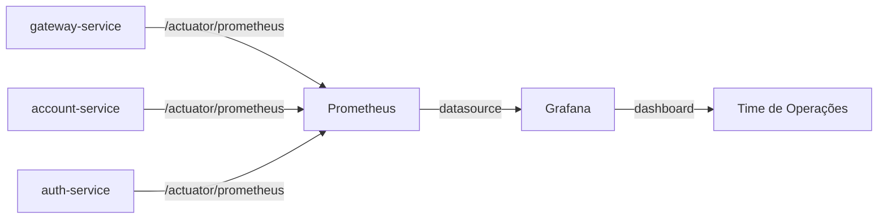

# Observabilidade

A plataforma Store inclui uma stack de observabilidade baseada em Prometheus e Grafana integrada ao `compose.yaml` do backend.

---

## Componentes



---

## Prometheus

| Atributo | Valor |
|---|---|
| Imagem | `prom/prometheus:latest` |
| Porta | `9090` |
| Config | montada via volume (`${SETUP}/prometheus/prometheus.yml`) |
| URL (local) | `http://localhost:9090` |

### Configuração de scrape

O arquivo `prometheus.yml` deve definir os jobs de scrape apontando para os serviços Spring Boot via endpoint `/actuator/prometheus`.

```yaml
# Exemplo de prometheus.yml
scrape_configs:
  - job_name: 'gateway'
    static_configs:
      - targets: ['gateway:8080']

  - job_name: 'account'
    static_configs:
      - targets: ['account:8080']

  - job_name: 'auth'
    static_configs:
      - targets: ['auth:8080']
```

---

## Grafana

| Atributo | Valor |
|---|---|
| Imagem | `grafana/grafana:latest` |
| Porta | `3000` |
| Admin | `admin` / `admin` (configurável via `GF_SECURITY_ADMIN_PASSWORD`) |
| Datasource | provisionado via volume (`${SETUP}/grafana/provisioning/datasources`) |
| URL (local) | `http://localhost:3000` |

### Provisionamento automático do datasource

O Grafana é provisionado automaticamente com o Prometheus como datasource via arquivo de configuração:

```yaml
# grafana/provisioning/datasources/prometheus.yml
apiVersion: 1
datasources:
  - name: Prometheus
    type: prometheus
    url: http://prometheus:9090
    isDefault: true
```

---

## Métricas Disponíveis

Com Spring Boot Actuator + Micrometer configurados nos serviços, as métricas padrão incluem:

| Categoria | Exemplos |
|---|---|
| HTTP | `http_server_requests_seconds`, taxa de erros por rota |
| JVM | heap, GC, threads |
| Sistema | CPU, memória do processo |
| Personalizadas | métricas específicas de negócio via `@Counted`, `@Timed` |
