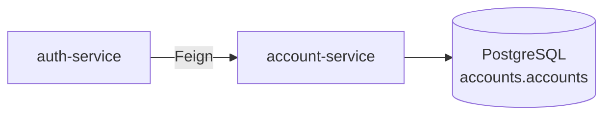
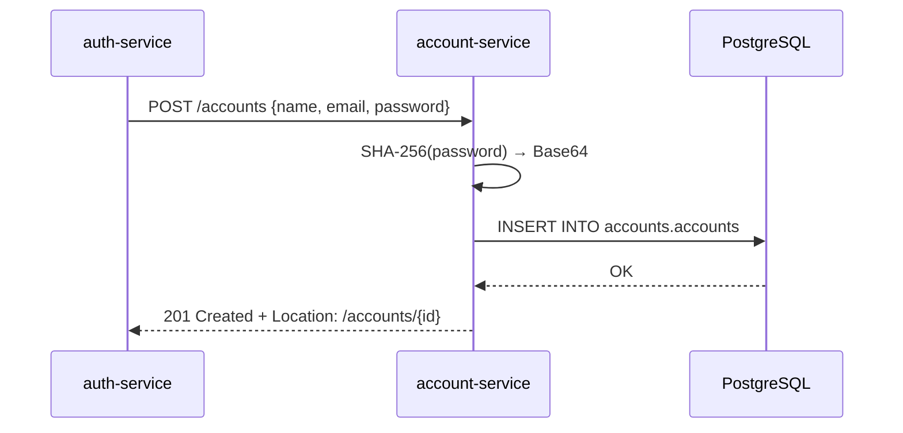

# account-service

Microsserviço Spring Boot que gerencia contas de usuário. Implementa a interface `AccountController` da biblioteca [`account`](account.md) e persiste dados no PostgreSQL via JPA + Flyway.

---

## Responsabilidade

`account-service` é a **fonte de verdade** para dados de conta. Armazena credenciais como hashes SHA-256 e nunca expõe senhas nas respostas. Outros serviços se comunicam com ele exclusivamente através da biblioteca Feign `account`.



---

## Stack

| Camada | Tecnologia |
|---|---|
| Linguagem | Java 25 |
| Framework | Spring Boot 4.x + Spring Data JPA |
| Banco de dados | PostgreSQL 17 |
| Migrações | Flyway |
| Utilitários | Lombok |

---

## Endpoints

Todas as rotas têm prefixo `/accounts`. O serviço escuta na porta `8080`.

| Método | Caminho | Descrição | Resposta |
|---|---|---|---|
| `POST` | `/accounts` | Criar nova conta | `201 Created` + header `Location` |
| `DELETE` | `/accounts/{id}` | Deletar uma conta | `204 No Content` |
| `GET` | `/accounts` | Listar todas as contas | `200 OK` + `AccountOut[]` |
| `GET` | `/accounts/{id}` | Buscar conta por ID | `200 OK` + `AccountOut` |
| `POST` | `/accounts/login` | Buscar por e-mail + senha | `200 OK` + `AccountOut` |
| `GET` | `/accounts/health-check` | Liveness probe | `200 OK` |

---

## Fluxo de Criação de Conta



---

## Schema do Banco de Dados

Gerenciado pelo Flyway — as migrações rodam automaticamente no startup.

```sql
CREATE SCHEMA IF NOT EXISTS accounts;

CREATE TABLE accounts.accounts (
    id              VARCHAR(36)  PRIMARY KEY,   -- UUID gerado pelo JPA
    name            VARCHAR(256) NOT NULL,
    email           VARCHAR(256) NOT NULL UNIQUE,
    password_sha256 VARCHAR(64)  NOT NULL
);

CREATE INDEX idx_email_sha256 ON accounts (email, password_sha256);
```

### Hash de senha

Senhas nunca são armazenadas em texto plano. Na criação e no login, o serviço computa `SHA-256(password)` codificado em Base64 e armazena/consulta esse valor.

---

## Variáveis de Ambiente

| Variável | Descrição |
|---|---|
| `DATABASE_HOST` | Hostname do PostgreSQL |
| `DATABASE_PORT` | Porta do PostgreSQL (normalmente `5432`) |
| `DATABASE_DB` | Nome do banco de dados |
| `DATABASE_USERNAME` | Usuário do banco |
| `DATABASE_PASSWORD` | Senha do banco |

---

## Configuração (`application.yaml`)

```yaml
server:
  port: 8080

spring:
  datasource:
    url: jdbc:postgresql://${DATABASE_HOST}:${DATABASE_PORT}/${DATABASE_DB}
    username: ${DATABASE_USERNAME}
    password: ${DATABASE_PASSWORD}

  flyway:
    baseline-on-migrate: true
    schemas: accounts

  jpa:
    properties:
      hibernate:
        default_schema: accounts
```

---

## Build e Execução

```bash
cd api/account-service
mvn clean package
java -jar target/account-1.0.0.jar
```

Via Docker Compose (nome do serviço: `account`):
```bash
cd api/
docker compose up -d --build account
```
