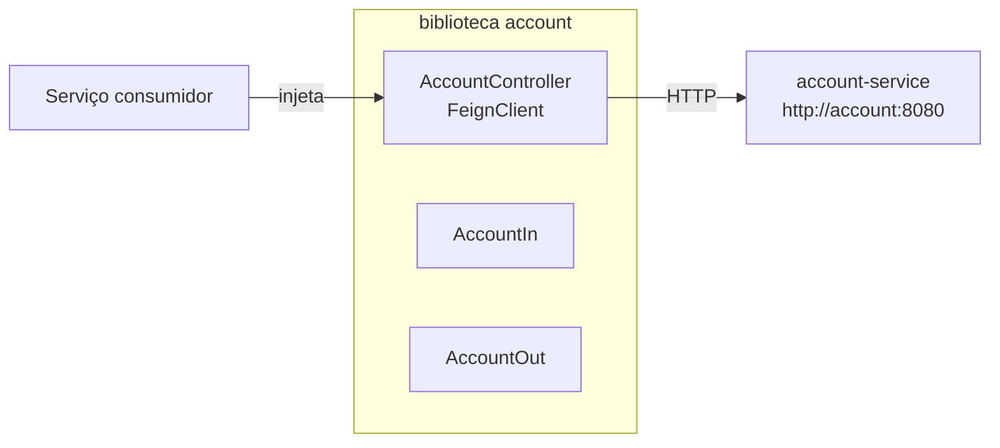

# account (biblioteca)

Biblioteca de Feign client para o [`account-service`](account-service.md). Outros serviços importam este artefato para se comunicar com o serviço de contas via HTTP sem escrever código boilerplate REST.

---

## Visão Geral

O módulo `account` expõe uma interface `@FeignClient` (`AccountController`) que mapeia cada endpoint de conta para um método Java tipado, junto com os DTOs compartilhados (`AccountIn`, `AccountOut`) usados em requisições e respostas.



---

## Stack

| Camada | Tecnologia |
|---|---|
| Linguagem | Java 25 |
| Framework | Spring Boot 4.x + Spring Cloud OpenFeign |
| Utilitários | Lombok |

---

## Endpoints mapeados

O cliente aponta para `http://account:8080` (container `account-service` na rede interna Docker).

| Método | Caminho | Descrição |
|---|---|---|
| `POST` | `/accounts` | Criar nova conta. Retorna `201 Created` com header `Location`. |
| `DELETE` | `/accounts/{id}` | Deletar conta por ID. Retorna `204 No Content`. |
| `GET` | `/accounts` | Listar todas as contas. |
| `GET` | `/accounts/{id}` | Buscar uma conta por ID. |
| `POST` | `/accounts/login` | Buscar conta por e-mail + senha (usado internamente pelo auth-service). |
| `GET` | `/accounts/health-check` | Liveness probe. Retorna `200 OK`. |

---

## Modelos de Dados

### `AccountIn`

Usado para criação de conta e login.

```json
{
  "name": "Jane Doe",
  "email": "jane@example.com",
  "password": "secret"
}
```

> `name` é opcional para login — apenas `email` e `password` são usados nesse caso.

### `AccountOut`

Retornado em todas as respostas de conta.

```json
{
  "id": "550e8400-e29b-41d4-a716-446655440000",
  "name": "Jane Doe",
  "email": "jane@example.com"
}
```

> Senhas nunca são retornadas.

---

## Como Usar

**1. Adicionar a dependência no `pom.xml`:**

```xml
<dependency>
    <groupId>store</groupId>
    <artifactId>account</artifactId>
    <version>1.0.0</version>
</dependency>
```

**2. Habilitar Feign clients na aplicação Spring Boot:**

```java
@EnableFeignClients(basePackages = "store.account")
@SpringBootApplication
public class YourApplication { ... }
```

**3. Injetar e usar:**

```java
@Autowired
private AccountController accountController;

// Criar uma conta
accountController.create(AccountIn.builder()
    .name("Jane Doe")
    .email("jane@example.com")
    .password("secret")
    .build()
);

// Buscar por ID
AccountOut account = accountController.findById(id).getBody();
```

---

## Build

```bash
cd api/account
mvn clean install
```

O artefato é instalado no repositório Maven local e pode ser consumido pelos outros serviços neste monorepo.
