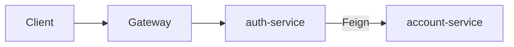
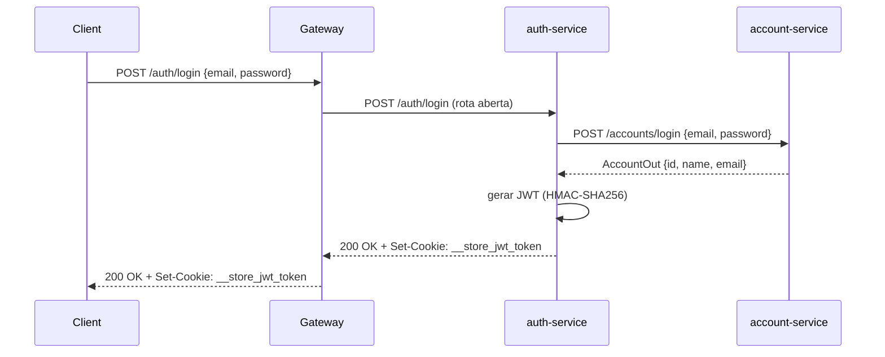

# auth-service

Microsserviço Spring Boot que lida com autenticação e ciclo de vida de JWT. Implementa a interface `AuthController` da biblioteca [`auth`](auth.md) e delega buscas de conta ao `account-service` via Feign.

---

## Responsabilidade

`auth-service` é o **único serviço que emite e valida JWTs**. Fica atrás do gateway e também é chamado diretamente pelo filtro do gateway para resolver tokens antes de encaminhar requisições protegidas.



---

## Stack

| Camada | Tecnologia |
|---|---|
| Linguagem | Java 25 |
| Framework | Spring Boot 4.x + Spring Cloud OpenFeign |
| Segurança | JJWT (HS256 / HMAC-SHA) |
| Utilitários | Lombok |

---

## Endpoints

Todas as rotas têm prefixo `/auth`. O serviço escuta na porta `8080`.

| Método | Caminho | Auth | Descrição |
|---|---|---|---|
| `POST` | `/auth/login` | Não | Valida credenciais, emite cookie JWT |
| `POST` | `/auth/register` | Não | Cria nova conta via account-service |
| `GET` | `/auth/logout` | Não | Limpa o cookie JWT (`maxAge=0`) |
| `POST` | `/auth/solve` | Não | Valida JWT e retorna o `idAccount` |
| `GET` | `/auth/whoiam` | Sim (header `id-account`) | Retorna detalhes da conta pelo ID |
| `GET` | `/auth/health-check` | Não | Liveness probe — retorna `200 OK` |

---

## Fluxo de Login



---

## Cookie JWT

Após login bem-sucedido, um header `Set-Cookie` é enviado:

| Atributo | Valor |
|---|---|
| Nome | `__store_jwt_token` |
| `HttpOnly` | configurável (`JWT_HTTP_ONLY`) |
| `Secure` | `true` |
| `SameSite` | `None` |
| `Path` | `/` |
| `MaxAge` | 24 horas (86.400.000 ms) |

### Payload do JWT

| Campo | Descrição |
|---|---|
| `id` | UUID da conta |
| `sub` | Nome do usuário |
| `email` | E-mail da conta |
| `iss` | `Insper::PMA` |
| `nbf` | Not Before |
| `exp` | Expiration |

---

## Variáveis de Ambiente

| Variável | Descrição |
|---|---|
| `JWT_SECRET_KEY` | Chave HMAC codificada em Base64 para assinar e verificar tokens |
| `JWT_HTTP_ONLY` | Boolean — se o cookie deve ser `HttpOnly` |

---

## Configuração (`application.yaml`)

```yaml
server:
  port: 8080

store:
  jwt:
    secretKey: ${JWT_SECRET_KEY}
    duration: 86400000   # 24 horas em milissegundos
    httpOnly: ${JWT_HTTP_ONLY}
```

---

## Dependências Internas

| Serviço | Como | Propósito |
|---|---|---|
| `account-service` | Feign (`http://account:8080`) | Buscar contas por credenciais ou ID, criar contas no registro |

---

## Build e Execução

```bash
cd api/auth-service
mvn clean package
java -jar target/auth-1.0.0.jar
```

Via Docker Compose (nome do serviço: `auth`):
```bash
cd api/
docker compose up -d --build auth
```
