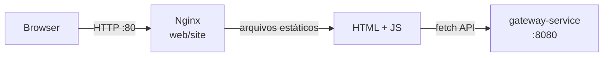

# web/site — Frontend

Frontend estático servido por Nginx. Construído com HTML + JavaScript vanilla, sem frameworks ou bundlers.

---

## Visão Geral

O frontend é a interface de usuário da plataforma Store. É servido pelo Nginx diretamente a partir de arquivos estáticos e se comunica exclusivamente com o `gateway-service` para todas as operações de API.



---

## Stack

| Camada | Tecnologia |
|---|---|
| Runtime | Nginx Alpine |
| Linguagem | HTML5 + JavaScript (ES6+) |
| Comunicação | Fetch API (cookie-based auth) |

---

## Estrutura

```
web/
├── site/
│   └── app/          # Arquivos servidos pelo Nginx
│       ├── index.html
│       └── ...
└── compose.yaml      # Docker Compose para o Nginx
```

---

## Docker Compose

```yaml
name: store-site

services:
  site:
    image: nginx:alpine
    hostname: site
    ports:
      - 80:80
    volumes:
      - ./site/app:/usr/share/nginx/html:ro
```

Os arquivos estáticos são montados como volume somente leitura dentro do container Nginx.

---

## Autenticação no Frontend

O frontend usa **cookies HttpOnly** para autenticação. O fluxo é:

1. Usuário preenche formulário de login → `POST /auth/login` para o gateway
2. Gateway retorna `Set-Cookie: __store_jwt_token` 
3. O browser envia o cookie automaticamente em todas as requisições subsequentes
4. Em rotas protegidas, o gateway valida o cookie antes de encaminhar

Não é necessário armazenar tokens manualmente — o browser gerencia o cookie.

---

## Executando

```bash
cd web/
docker compose up -d
```

Site disponível em `http://localhost:80`.
