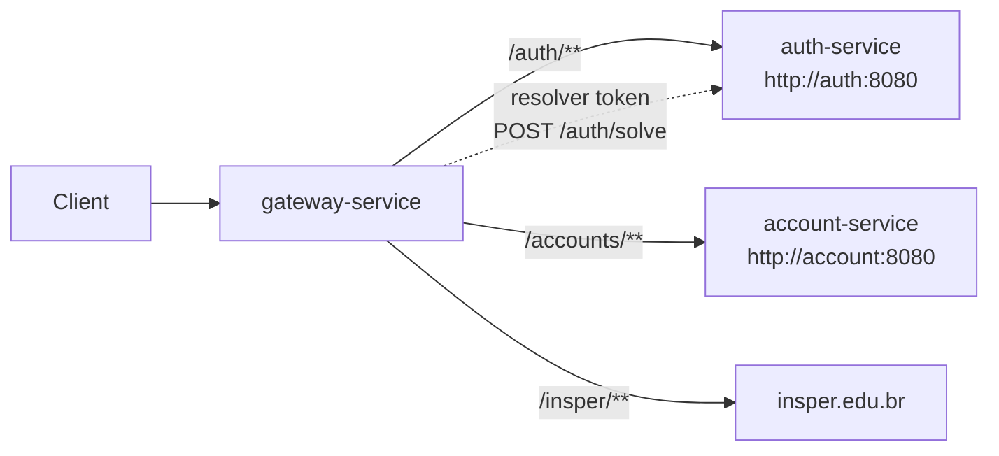
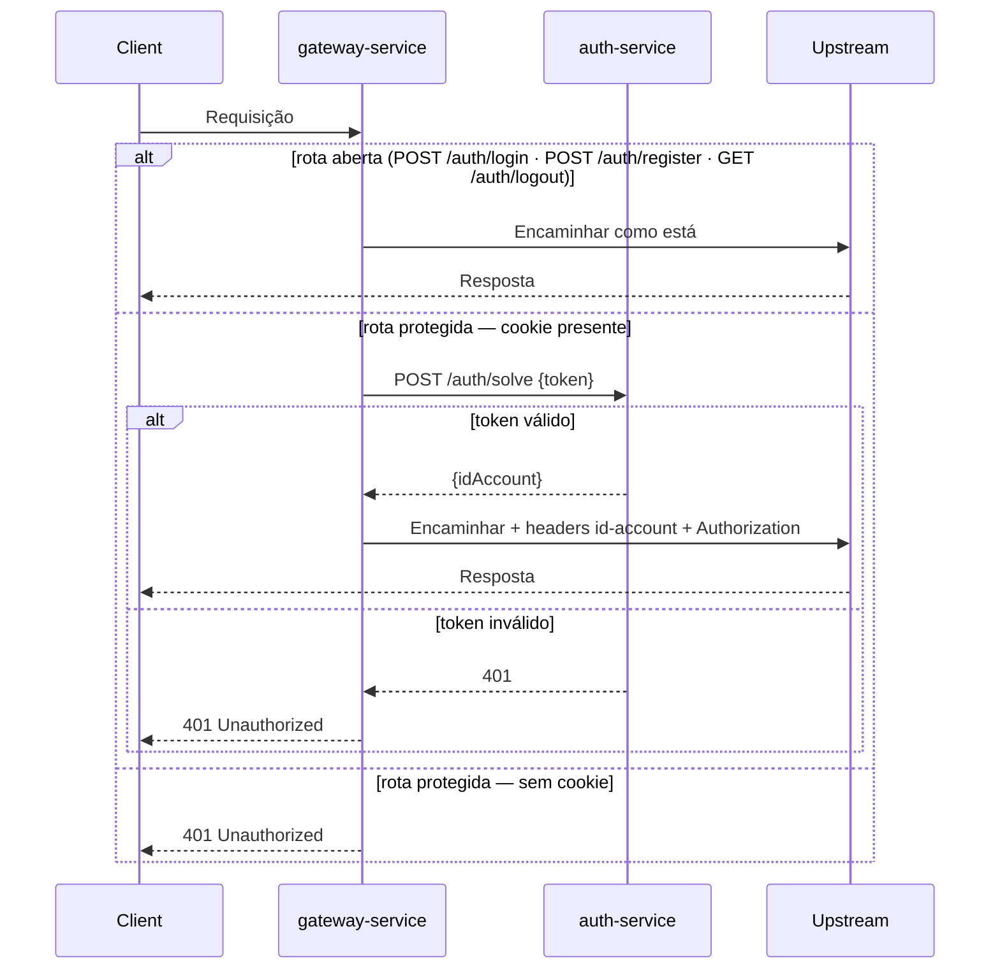

# gateway-service

Spring Cloud Gateway (reativo) que é o **único ponto de entrada** para todo o tráfego de clientes. Gerencia CORS, roteamento de proxies e autorização baseada em JWT antes de encaminhar requisições para os serviços downstream.

---

## Responsabilidade

Toda requisição do frontend passa pelo gateway. Ele verifica o cookie JWT válido em rotas protegidas, resolve o token contra o `auth-service` e injeta headers de identidade antes de encaminhar a requisição upstream.



---

## Stack

| Camada | Tecnologia |
|---|---|
| Linguagem | Java 25 |
| Framework | Spring Boot 4.x + Spring Cloud Gateway (WebFlux) |

---

## Rotas

| ID | Caminho de entrada | Upstream |
|---|---|---|
| `auth` | `/auth/**` | `http://auth:8080` |
| `accounts` | `/accounts/**` | `http://account:8080` |
| `insper` | `/insper/**` | `https://www.insper.edu.br` |

---

## Filtro de Autorização

Um `GlobalFilter` (`AuthorizationFilter`) é executado em cada requisição:



Com token válido, os seguintes headers são injetados na requisição encaminhada:

- `id-account: <uuid>` — ID da conta extraído do JWT
- `Authorization: Bearer <jwt>` — o token original

### Rotas Abertas (sem autenticação)

| Método | Caminho |
|---|---|
| `POST` | `/auth/login` |
| `POST` | `/auth/register` |
| `GET` | `/auth/logout` |

Todas as outras rotas exigem um cookie `__store_jwt_token` válido.

---

## Endpoints do Gateway

| Método | Caminho | Descrição |
|---|---|---|
| `GET` | `/` | Retorna `"Store API"` — verificação básica de alcançabilidade |
| `GET` | `/health-check` | Liveness probe, retorna `200 OK` |

---

## CORS

Configurado globalmente para todas as rotas (`/**`) via variáveis de ambiente:

| Variável | Descrição |
|---|---|
| `CORS_ALLOWED_ORIGINS` | Lista separada por vírgulas de origens permitidas |
| `CORS_ALLOWED_CREDENTIALS` | `true` / `false` — deve ser `true` quando cookies são usados |

Todos os headers e métodos são permitidos (`"*"`).

---

## Configuração (`application.yaml`)

```yaml
spring:
  cloud:
    gateway:
      server:
        webflux:
          globalcors:
            corsConfigurations:
              '[/**]':
                allowedOrigins: ${CORS_ALLOWED_ORIGINS}
                allowedHeaders: "*"
                allowedMethods: "*"
                allowCredentials: ${CORS_ALLOWED_CREDENTIALS}
          routes:
            - id: auth
              uri: http://auth:8080
              predicates:
                - Path=/auth/**
            - id: accounts
              uri: http://account:8080
              predicates:
                - Path=/accounts/**
            - id: insper
              uri: https://www.insper.edu.br
              predicates:
                - Path=/insper/**
```

---

## Build e Execução

```bash
cd api/gateway-service
mvn clean package
java -jar target/gateway-1.0.0.jar
```

Via Docker Compose (nome do serviço: `gateway`, com 3 réplicas por padrão):
```bash
cd api/
docker compose up -d --build gateway
```
