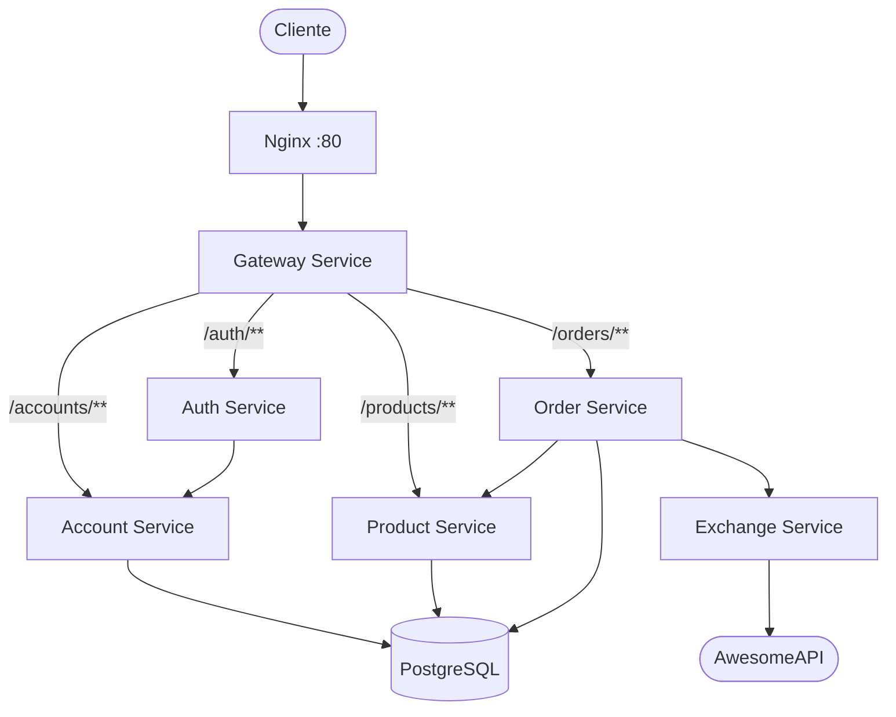
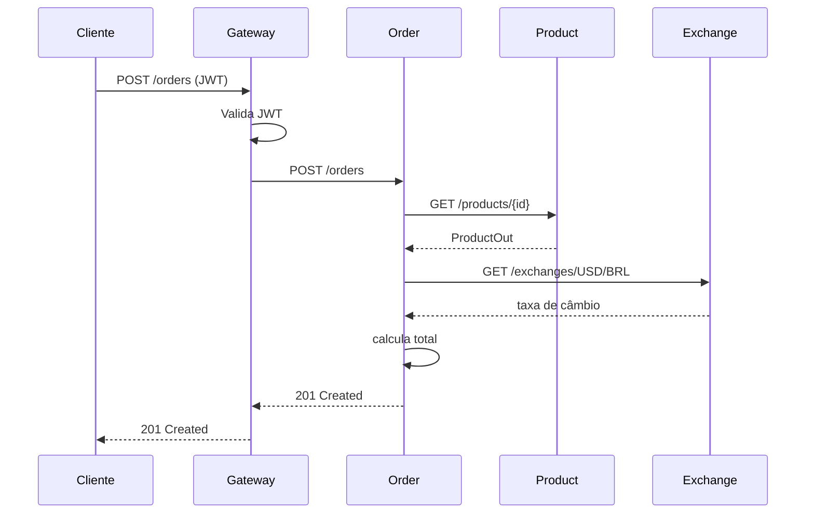

# Arquitetura

## Visão Geral

## Componentes

### Nginx (Load Balancer)

Ponto de entrada único na porta 80. Distribui tráfego entre as réplicas do gateway. No Kubernetes, substituído por um `Service` do tipo `LoadBalancer` provisionado pelo EKS.

### Gateway Service

Roteia requisições para os microsserviços internos. Valida JWT antes de encaminhar. Configurado via Spring Cloud Gateway com rotas declarativas.

| Rota | Destino |
|---|---|
| `/accounts/**` | account-service |
| `/auth/**` | auth-service |
| `/products/**` | product-service |

### Auth Service

Emite e valida tokens JWT. Depende do account-service para verificar credenciais do usuário.

### Account Service

Gerencia contas de usuário. Persistência em PostgreSQL com Flyway migrations no schema `accounts`.

### Product Service

Gerencia o catálogo de produtos. Persistência em PostgreSQL com Flyway migrations no schema `products`. Expõe métricas Prometheus.

### Order Service

Orquestra criação de pedidos. Consulta product-service para dados do produto e exchange-service para conversão de moeda.

### Exchange Service

Fornece taxas de câmbio em tempo real consultando a AwesomeAPI externa. Implementado em Python/FastAPI.

## Fluxo de Criação de Pedido

## Infraestrutura

| Ambiente | Orquestrador | Banco | Registry |
|---|---|---|---|
| Local | Docker Compose | PostgreSQL container | Docker Hub |
| Produção | AWS EKS (namespace `store`) | PostgreSQL container / RDS | Docker Hub |
